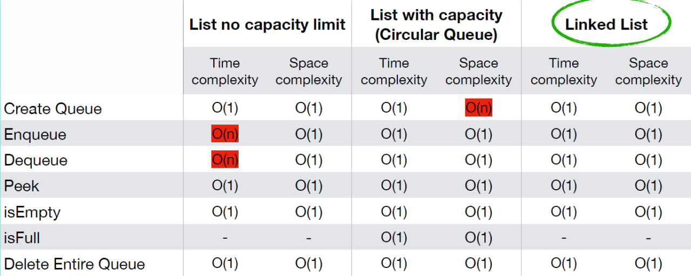

# Time and Space Complexity of Queue Operations with Python List

|                     | Time Complexity | Space Complexity |
| ------------------- | --------------- | ---------------- |
| Create Queue        | O(1)            | O(1)             |
| Enqueue             | O(n)            | O(1)             |
| Dequeue             | O(n)            | O(1)             |
| Peek                | O(1)            | O(1)             |
| isEmpty             | O(1)            | O(1)             |
| Delete Entire Queue | O(1)            | O(1)             |

---

# Time and Space Complexity of Circular Queue Operations

|                     | Time complexity | Space complexity |
| ------------------- | --------------- | ---------------- |
| Create Queue        | O(1)            | O(n)             |
| Enqueue             | O(1)            | O(1)             |
| Dequeue             | O(1)            | O(1)             |
| Peek                | O(1)            | O(1)             |
| isEmpty             | O(1)            | O(1)             |
| isFull              | O(1)            | O(1)             |
| Delete Entire Queue | O(1)            | O(1)             |

---

# Time and Space Complexity of Queue Operations using Linked List

|                     | Time complexity | Space complexity |
| ------------------- | --------------- | ---------------- |
| Create Queue        | O(1)            | O(1)             |
| Enqueue             | O(1)            | O(1)             |
| Dequeue             | O(1)            | O(1)             |
| Peek                | O(1)            | O(1)             |
| isEmpty             | O(1)            | O(1)             |
| Delete Entire Queue | O(1)            | O(1)             |

---

# Time and Space Complexity Queue: List vs Linked List

