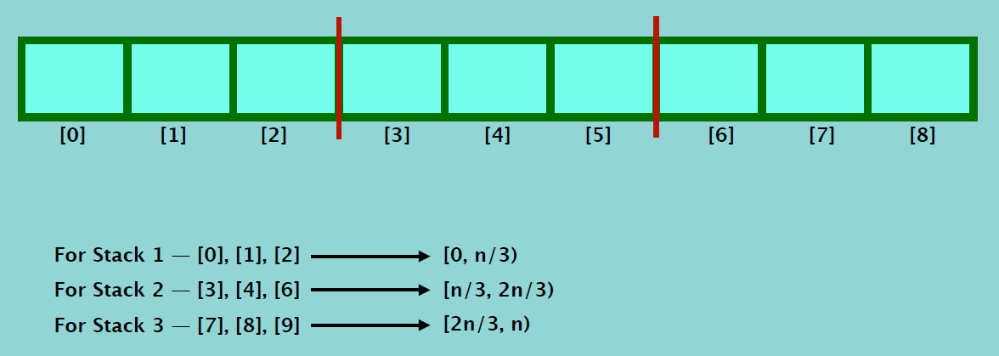

# Cracking Stack and Queue Interview Questions (Amazon, Facebook, Apple, Microsoft)
---

## Interview Questions 1: Three in one
Describe how you could use a single Python list to implement three stacks

 

## Interview Questions 2: