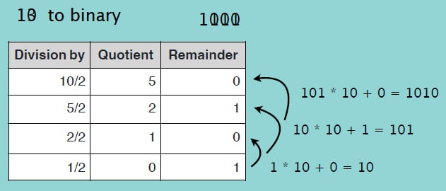

# Cracking Recursion Interview Questions

---

## Interview Question 1

How to find the sum of digits of a positive integer number using recursion?

<br>

`Step 1: Recursive case - The flow`

```
10   10/10  = 1   and Remainder = 1
54   54/10  = 5   and Remainder = 4
112  112/10 = 11  and Remainder = 2
     11/10  = 1   and remainder = 1
```

<br>

`f(n) = n % 10 + f(n/10)`

<br>

`Step 2: Base case - The stopping criterion`

```
- n = 0
```

<br>

`Step 3: Unintentional case - The constraint`

```
- sumOfDigits(-11) ??
- sumOfDigits(1.5) ??
```

<br>

## Interview Question 2

How to calculate power of a number using recursion?

<br>

`Step 1: Recursive case - The flow`

```
2^4 = 2 * 2 * 2 * 2
x^a * x^b = x^(a+b)
x^3 * x^4 = x^(3+4)
```

<br>

`x^n = x * x^(n-1)`

<br>

`Step 2: Base case - The stopping criterion`

```
- n = 0
```

<br>

`Step 3: Unintentional case - The constraint`

```
- power(-1, 2) ??
- power(3.2, 2) ??
- power(2, 1.2) ??
- power(2, -1) ??
```

<br>

## Interview Question 3

How to find GCD (Greatest Common Divisor) of two numbers using recursion?

<br>

`Step 1: Recursive case - The flow`

GCD is the largest positive integer that divides the numbers without a reminder

```
gcd(8, 12) = 4
8 = 2 * 2 * 2
12 = 2 * 2 * 3
```

```
Euclidean algorithm

gcd(48, 18)
Step 1: 48/18 = 2 remainder 12
Step 2: 18/12 = 1 remainder 6
Step 3: 12/6 = 2 remainder 0
```

<br>

```
gcd(a, 0) = a
gcd(a, b) = gcd(b, a mod b)
```

<br>

`Step 2: Base case - The stopping criterion`

```
- b = 0
```

<br>

`Step 3: Unintentional case - The constraint`

```
- Positive integers
- Convert negative numbers to positive
```

<br>

## Interview Question 4

<br>

`Step 1: Recursive case - The flow`

```
Step 1: Divide the number by 2
Step 2: Get the integer quotient for the next iteration
Step 3: Get the remainder for the binary digit
Step 4: Repeat the steps until the quotient is equal to 0
```



<br>

`f(n) = n mod 2 + 10 * f(n/2)`

<br>

`Step 2: Base case - The stopping criterion`

```
- n = 0
```

<br>

`Step 3: Unintentional case - The constraint`

```
- power(-1, 2) ??
- power(3.2, 2) ??
- power(2, 1.2) ??
- power(2, -1) ??
```

<br>
